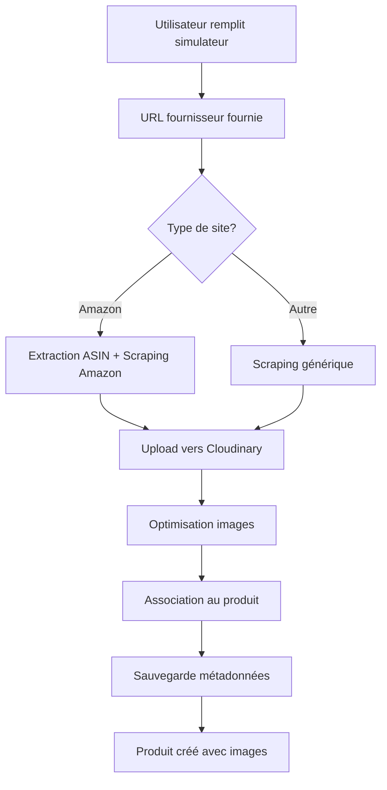

# Guide du Système d'Images des Fournisseurs

## 🎯 **Objectif**

Le nouveau système récupère automatiquement les images depuis les URLs des fournisseurs (Amazon, etc.) et les uploade sur Cloudinary lors de la création de produits importés via le simulateur.

## 🚀 **Fonctionnalités**

### **✅ Ce qui fonctionne maintenant**

1. **Scraping automatique d'images** depuis :
   - Amazon (toutes les versions : .fr, .com, .co.uk, etc.)
   - Sites e-commerce génériques

2. **Upload automatique sur Cloudinary** avec :
   - Optimisation des images (800x800px, qualité auto)
   - Organisation dans le dossier `products/imported`
   - Nommage cohérent des fichiers

3. **Association automatique** :
   - Images liées au produit via le modèle `Media`
   - Sauvegarde de l'ASIN pour Amazon
   - Sauvegarde de l'URL du fournisseur

4. **Intégration complète** dans le simulateur d'importation

## 🔧 **Configuration requise**

### **1. Compte Cloudinary**

1. Créez un compte gratuit sur [cloudinary.com](https://cloudinary.com)
2. Récupérez vos identifiants depuis le dashboard :
   - Cloud Name
   - API Key
   - API Secret

### **2. Variables d'environnement**

Ajoutez dans votre fichier `.env.local` :

```env
# Configuration Cloudinary pour les images de produits
CLOUDINARY_CLOUD_NAME=votre_cloud_name
CLOUDINARY_API_KEY=votre_api_key
CLOUDINARY_API_SECRET=votre_api_secret
```

### **3. Installation automatique**

Exécutez le script de configuration :

```bash
node scripts/setup-cloudinary-integration.js
```

Ce script va :
- Installer la dépendance Cloudinary
- Ajouter les variables d'environnement manquantes
- Tester la configuration

## 📋 **Utilisation**

### **1. Via le simulateur d'importation**

1. Ouvrez : `http://localhost:3000/admin/products/imported/simulation`
2. Connectez-vous en tant qu'administrateur
3. Remplissez le formulaire :
   - **Nom du produit** : "iPhone 15 Pro 128GB"
   - **URL du produit** : "https://www.amazon.fr/dp/B0CHX1W1XY"
   - **Prix fournisseur** : 1000 USD
   - **Poids** : 0.2 kg
   - **Entrepôt** : États-Unis
4. Calculez les coûts
5. Créez le produit

### **2. Traitement automatique**

Le système va automatiquement :

1. **Extraire l'ASIN** depuis l'URL Amazon
2. **Scraper les images** de la page produit
3. **Uploader sur Cloudinary** avec optimisation
4. **Associer au produit** créé
5. **Sauvegarder les métadonnées** (ASIN, URL, etc.)

## 🔍 **Types d'URLs supportées**

### **Amazon (recommandé)**
```
https://www.amazon.fr/dp/B0CHX1W1XY
https://amazon.com/dp/B08N5WRWNW
https://www.amazon.co.uk/dp/B07XJ8C8F5
```

### **Sites e-commerce génériques**
```
https://www.apple.com/iphone-15-pro/
https://www.dior.com/fr_fr/products/beauty-Y0685240
https://www.rolex.com/watches/submariner/
```

## 📊 **Résultats attendus**

### **Pour Amazon**
- **3-5 images** haute résolution extraites
- **ASIN sauvegardé** comme attribut
- **URL Amazon** sauvegardée
- **Images optimisées** sur Cloudinary

### **Pour autres sites**
- **2-3 images** principales extraites
- **URL fournisseur** sauvegardée
- **Images optimisées** sur Cloudinary

## 🧪 **Tests et vérification**

### **1. Test de configuration**

```bash
node scripts/test-supplier-images-simple.js
```

Ce script vérifie :
- Configuration Cloudinary
- Extraction d'ASIN
- Produits existants avec URLs
- État de la base de données

### **2. Test manuel**

1. Créez un produit via le simulateur
2. Vérifiez dans l'administration des produits
3. Consultez les images associées
4. Vérifiez les attributs sauvegardés

### **3. Vérification Cloudinary**

1. Connectez-vous à votre dashboard Cloudinary
2. Naviguez vers `Media Library > products/imported`
3. Vérifiez que les images sont bien uploadées

## 📁 **Structure des fichiers**

### **Nouveau système**
```
lib/supplier-images.ts          # Système principal d'images
scripts/setup-cloudinary-integration.js    # Configuration
scripts/test-supplier-images-simple.js     # Tests
```

### **API modifiée**
```
app/api/admin/products/create-from-simulation/route.ts
```

## 🔄 **Workflow complet**



## ⚠️ **Limitations et notes**

### **Limitations techniques**
- **Rate limiting** : Respecte les limites des sites
- **Anti-bot** : Certains sites peuvent bloquer le scraping
- **Images dynamiques** : Certaines images peuvent ne pas être détectées

### **Fallback**
- Si le scraping échoue, le produit est créé sans images
- Les métadonnées (ASIN, URL) sont toujours sauvegardées
- Possibilité d'ajouter des images manuellement plus tard

### **Performance**
- **Upload asynchrone** : N'affecte pas la création du produit
- **Optimisation automatique** : Images redimensionnées pour le web
- **Cache Cloudinary** : Améliore les performances d'affichage

## 🎉 **Avantages**

1. **Automatisation complète** : Plus besoin d'ajouter des images manuellement
2. **Images haute qualité** : Directement depuis les fournisseurs
3. **Optimisation automatique** : Taille et qualité optimisées
4. **Traçabilité** : ASIN et URLs sauvegardés pour référence
5. **Évolutivité** : Support facile de nouveaux sites

## 🔧 **Dépannage**

### **Problème : Aucune image récupérée**
- Vérifiez que l'URL est accessible
- Testez avec une URL Amazon connue
- Vérifiez les logs du serveur Next.js

### **Problème : Erreur Cloudinary**
- Vérifiez vos identifiants dans `.env.local`
- Testez la connexion avec le script de configuration
- Vérifiez les quotas de votre compte Cloudinary

### **Problème : Images de mauvaise qualité**
- Les paramètres d'optimisation peuvent être ajustés dans `lib/supplier-images.ts`
- Cloudinary propose différents modes de transformation

## 📞 **Support**

Pour toute question ou problème :
1. Consultez les logs du serveur Next.js
2. Exécutez les scripts de test
3. Vérifiez la configuration Cloudinary
4. Testez avec des URLs Amazon connues

---

**Le système est maintenant prêt pour récupérer automatiquement les images des fournisseurs et les intégrer dans vos produits importés !** 🚀 

## 🎯 **Objectif**

Le nouveau système récupère automatiquement les images depuis les URLs des fournisseurs (Amazon, etc.) et les uploade sur Cloudinary lors de la création de produits importés via le simulateur.

## 🚀 **Fonctionnalités**

### **✅ Ce qui fonctionne maintenant**

1. **Scraping automatique d'images** depuis :
   - Amazon (toutes les versions : .fr, .com, .co.uk, etc.)
   - Sites e-commerce génériques

2. **Upload automatique sur Cloudinary** avec :
   - Optimisation des images (800x800px, qualité auto)
   - Organisation dans le dossier `products/imported`
   - Nommage cohérent des fichiers

3. **Association automatique** :
   - Images liées au produit via le modèle `Media`
   - Sauvegarde de l'ASIN pour Amazon
   - Sauvegarde de l'URL du fournisseur

4. **Intégration complète** dans le simulateur d'importation

## 🔧 **Configuration requise**

### **1. Compte Cloudinary**

1. Créez un compte gratuit sur [cloudinary.com](https://cloudinary.com)
2. Récupérez vos identifiants depuis le dashboard :
   - Cloud Name
   - API Key
   - API Secret

### **2. Variables d'environnement**

Ajoutez dans votre fichier `.env.local` :

```env
# Configuration Cloudinary pour les images de produits
CLOUDINARY_CLOUD_NAME=votre_cloud_name
CLOUDINARY_API_KEY=votre_api_key
CLOUDINARY_API_SECRET=votre_api_secret
```

### **3. Installation automatique**

Exécutez le script de configuration :

```bash
node scripts/setup-cloudinary-integration.js
```

Ce script va :
- Installer la dépendance Cloudinary
- Ajouter les variables d'environnement manquantes
- Tester la configuration

## 📋 **Utilisation**

### **1. Via le simulateur d'importation**

1. Ouvrez : `http://localhost:3000/admin/products/imported/simulation`
2. Connectez-vous en tant qu'administrateur
3. Remplissez le formulaire :
   - **Nom du produit** : "iPhone 15 Pro 128GB"
   - **URL du produit** : "https://www.amazon.fr/dp/B0CHX1W1XY"
   - **Prix fournisseur** : 1000 USD
   - **Poids** : 0.2 kg
   - **Entrepôt** : États-Unis
4. Calculez les coûts
5. Créez le produit

### **2. Traitement automatique**

Le système va automatiquement :

1. **Extraire l'ASIN** depuis l'URL Amazon
2. **Scraper les images** de la page produit
3. **Uploader sur Cloudinary** avec optimisation
4. **Associer au produit** créé
5. **Sauvegarder les métadonnées** (ASIN, URL, etc.)

## 🔍 **Types d'URLs supportées**

### **Amazon (recommandé)**
```
https://www.amazon.fr/dp/B0CHX1W1XY
https://amazon.com/dp/B08N5WRWNW
https://www.amazon.co.uk/dp/B07XJ8C8F5
```

### **Sites e-commerce génériques**
```
https://www.apple.com/iphone-15-pro/
https://www.dior.com/fr_fr/products/beauty-Y0685240
https://www.rolex.com/watches/submariner/
```

## 📊 **Résultats attendus**

### **Pour Amazon**
- **3-5 images** haute résolution extraites
- **ASIN sauvegardé** comme attribut
- **URL Amazon** sauvegardée
- **Images optimisées** sur Cloudinary

### **Pour autres sites**
- **2-3 images** principales extraites
- **URL fournisseur** sauvegardée
- **Images optimisées** sur Cloudinary

## 🧪 **Tests et vérification**

### **1. Test de configuration**

```bash
node scripts/test-supplier-images-simple.js
```

Ce script vérifie :
- Configuration Cloudinary
- Extraction d'ASIN
- Produits existants avec URLs
- État de la base de données

### **2. Test manuel**

1. Créez un produit via le simulateur
2. Vérifiez dans l'administration des produits
3. Consultez les images associées
4. Vérifiez les attributs sauvegardés

### **3. Vérification Cloudinary**

1. Connectez-vous à votre dashboard Cloudinary
2. Naviguez vers `Media Library > products/imported`
3. Vérifiez que les images sont bien uploadées

## 📁 **Structure des fichiers**

### **Nouveau système**
```
lib/supplier-images.ts          # Système principal d'images
scripts/setup-cloudinary-integration.js    # Configuration
scripts/test-supplier-images-simple.js     # Tests
```

### **API modifiée**
```
app/api/admin/products/create-from-simulation/route.ts
```

## 🔄 **Workflow complet**


## ⚠️ **Limitations et notes**

### **Limitations techniques**
- **Rate limiting** : Respecte les limites des sites
- **Anti-bot** : Certains sites peuvent bloquer le scraping
- **Images dynamiques** : Certaines images peuvent ne pas être détectées

### **Fallback**
- Si le scraping échoue, le produit est créé sans images
- Les métadonnées (ASIN, URL) sont toujours sauvegardées
- Possibilité d'ajouter des images manuellement plus tard

### **Performance**
- **Upload asynchrone** : N'affecte pas la création du produit
- **Optimisation automatique** : Images redimensionnées pour le web
- **Cache Cloudinary** : Améliore les performances d'affichage

## 🎉 **Avantages**

1. **Automatisation complète** : Plus besoin d'ajouter des images manuellement
2. **Images haute qualité** : Directement depuis les fournisseurs
3. **Optimisation automatique** : Taille et qualité optimisées
4. **Traçabilité** : ASIN et URLs sauvegardés pour référence
5. **Évolutivité** : Support facile de nouveaux sites

## 🔧 **Dépannage**

### **Problème : Aucune image récupérée**
- Vérifiez que l'URL est accessible
- Testez avec une URL Amazon connue
- Vérifiez les logs du serveur Next.js

### **Problème : Erreur Cloudinary**
- Vérifiez vos identifiants dans `.env.local`
- Testez la connexion avec le script de configuration
- Vérifiez les quotas de votre compte Cloudinary

### **Problème : Images de mauvaise qualité**
- Les paramètres d'optimisation peuvent être ajustés dans `lib/supplier-images.ts`
- Cloudinary propose différents modes de transformation

## 📞 **Support**

Pour toute question ou problème :
1. Consultez les logs du serveur Next.js
2. Exécutez les scripts de test
3. Vérifiez la configuration Cloudinary
4. Testez avec des URLs Amazon connues

---

**Le système est maintenant prêt pour récupérer automatiquement les images des fournisseurs et les intégrer dans vos produits importés !** 🚀 