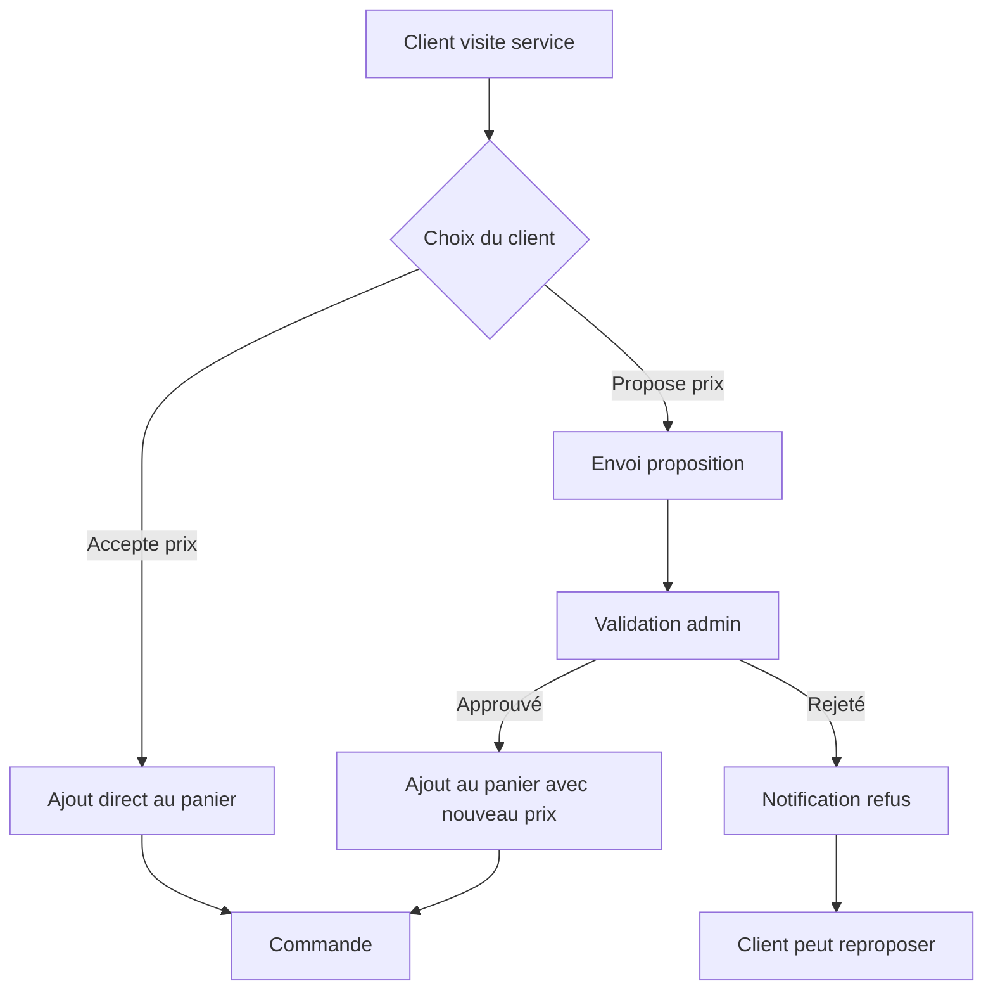
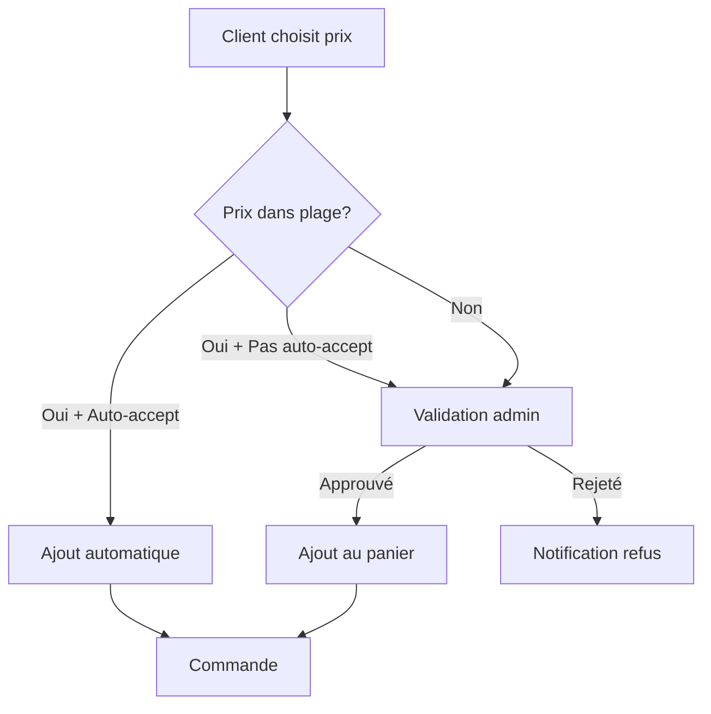
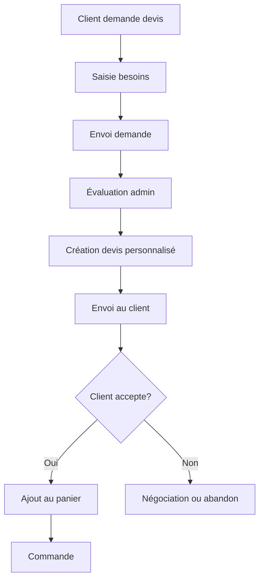

# 🎯 Guide Système de Pricing Avancé des Services

## Vue d'ensemble

Ce système permet de gérer différents types de pricing pour les services, avec validation admin et négociation de prix selon les besoins business.

## 🔧 Types de Pricing Disponibles

### 1. **FIXED** - Prix Fixe
- **Description** : Prix standard non négociable
- **Utilisation** : Services standardisés avec tarif fixe
- **Workflow** : Ajout direct au panier → Commande
- **Exemple** : Consultation Standard (50€)

### 2. **NEGOTIABLE** - Prix Négociable
- **Description** : Prix de base avec possibilité de négociation
- **Utilisation** : Services où le client peut proposer un prix
- **Workflow** : 
  - Client accepte le prix → Ajout direct au panier
  - Client propose un prix → Validation admin → Commande
- **Exemple** : Consultation Personnalisée (75€ négociable)

### 3. **RANGE** - Plage de Prix
- **Description** : Prix variable selon les besoins (min-max)
- **Utilisation** : Services avec complexité variable
- **Workflow** : 
  - Prix dans la plage + auto-accept → Ajout automatique
  - Prix hors plage → Validation admin → Commande
- **Exemple** : Audit Entreprise (150€-500€)

### 4. **QUOTE_REQUIRED** - Devis Obligatoire
- **Description** : Prix entièrement personnalisé
- **Utilisation** : Projets complexes nécessitant évaluation
- **Workflow** : Demande de devis → Évaluation admin → Prix personnalisé → Commande
- **Exemple** : Projet Sur Mesure (sur devis)

## 🗄️ Architecture Base de Données

### Nouveaux Modèles

```prisma
model Service {
  // Champs existants +
  pricingType     ServicePricingType @default(FIXED)
  minPrice        Decimal?
  maxPrice        Decimal?
  requiresQuote   Boolean @default(false)
  autoAcceptNegotiation Boolean @default(false)
  quotes          ServiceQuote[]
  cartItems       CartItem[]
}

model ServiceQuote {
  id            String @id @default(cuid())
  serviceId     String
  userId        String
  proposedPrice Decimal?
  adminPrice    Decimal?
  quantity      Int @default(1)
  status        ServiceQuoteStatus @default(PENDING)
  clientMessage String?
  adminMessage  String?
  validUntil    DateTime?
  // Relations...
}

model CartItem {
  // Champs existants +
  proposedPrice Decimal?
  finalPrice    Decimal?
  status        CartItemStatus @default(READY)
  serviceId     String?
  quoteId       String?
  expiresAt     DateTime?
}
```

### Énumérations

```prisma
enum ServicePricingType {
  FIXED
  NEGOTIABLE
  RANGE
  QUOTE_REQUIRED
}

enum ServiceQuoteStatus {
  PENDING
  APPROVED
  REJECTED
  EXPIRED
  CANCELLED
}

enum CartItemStatus {
  READY
  PENDING_QUOTE
  PENDING_APPROVAL
  APPROVED
  REJECTED
  EXPIRED
}
```

## 🎨 Composants Frontend

### ServicePricingSelector
Composant principal pour gérer les différents types de pricing :

```tsx
import { ServicePricingSelector } from '@/components/services/service-pricing-selector'

<ServicePricingSelector
  service={service}
  quantity={quantity}
  onAddToCart={handleAddToCart}
  onRequestQuote={handleRequestQuote}
  loading={loading}
/>
```

### ServiceCardWithPricing
Carte de service avec pricing intégré :

```tsx
import { ServiceCardWithPricing } from '@/components/services/service-card-with-pricing'

<ServiceCardWithPricing
  service={service}
  onAddToCart={handleAddToCart}
  onRequestQuote={handleRequestQuote}
  showFullPricing={false}
/>
```

## 🔗 API Endpoints

### Services & Devis
- `POST /api/services/quotes` - Créer demande de devis
- `GET /api/services/quotes` - Récupérer devis utilisateur
- `PUT /api/services/quotes` - Mettre à jour devis (admin)

### Panier Avancé
- `GET /api/cart/advanced` - Récupérer panier avec statuts
- `POST /api/cart/advanced` - Ajouter service avec pricing spécial

### Admin
- `GET /api/admin/quotes` - Récupérer tous les devis
- `GET /api/admin/quotes/stats` - Statistiques des devis

## 🛠️ Workflows Détaillés

### Workflow Service NEGOTIABLE



### Workflow Service RANGE avec Auto-Accept



### Workflow Service QUOTE_REQUIRED



## 👨‍💼 Interface Admin

### Page de Gestion des Devis
- **URL** : `/admin/quotes`
- **Fonctionnalités** :
  - Vue d'ensemble des devis en attente
  - Filtres par statut (En attente, Approuvés, Rejetés)
  - Interface de réponse avec prix et message
  - Indicateurs de priorité (ancienneté, type de service)

### Statuts des Devis
- **PENDING** : En attente de réponse admin
- **APPROVED** : Prix approuvé, prêt pour commande
- **REJECTED** : Prix refusé, client doit reproposer
- **EXPIRED** : Devis expiré (date limite dépassée)
- **CANCELLED** : Annulé par le client

## 📊 Statuts du Panier

### Statuts des Articles
- **READY** : Prêt pour commande (prix fixe)
- **PENDING_QUOTE** : En attente de devis admin
- **PENDING_APPROVAL** : En attente d'approbation prix négocié
- **APPROVED** : Prix approuvé, prêt pour commande
- **REJECTED** : Prix/devis rejeté
- **EXPIRED** : Devis/négociation expirée

### Gestion des Expirations
- **Négociations** : 7 jours par défaut
- **Devis** : Configurable par admin
- **Nettoyage automatique** : TODO - Cron job pour supprimer expirés

## 🔒 Sécurité & Permissions

### Validation des Prix
- Vérification des plages min/max
- Validation des prix proposés
- Contrôle des autorisations admin

### Audit Trail
- Historique des modifications de prix
- Logs des négociations
- Traçabilité des décisions admin

## 🚀 Déploiement & Migration

### Étapes de Déploiement

1. **Migration Base de Données**
   ```bash
   npx prisma migrate deploy
   ```

2. **Génération Client Prisma**
   ```bash
   npx prisma generate
   ```

3. **Ajout des Exemples** (optionnel)
   ```bash
   node scripts/add-service-pricing-examples.js
   ```

### Migration des Services Existants
Les services existants sont automatiquement configurés avec `pricingType: FIXED` pour maintenir la compatibilité.

## 📱 Expérience Utilisateur

### Interface Client
- **Badges visuels** pour identifier les types de pricing
- **Formulaires intuitifs** pour négociation et devis
- **Notifications temps réel** sur les statuts
- **Indicateurs d'expiration** pour les offres limitées

### Interface Admin
- **Dashboard centralisé** pour tous les devis
- **Filtres et recherche** avancés
- **Réponse rapide** avec templates
- **Indicateurs de performance** (taux d'approbation, revenus)

## 📈 Métriques & Analytics

### KPIs Recommandés
- **Taux de conversion** par type de pricing
- **Temps de réponse** admin moyen
- **Valeur moyenne** des négociations
- **Taux d'approbation** des devis

### Optimisations Possibles
- **Templates de réponse** pour l'admin
- **Règles d'auto-approbation** configurables
- **Notifications push** pour les admins
- **Intégration CRM** pour le suivi client

## 🎯 Cas d'Usage Recommandés

### E-commerce B2B
- Services de consulting avec pricing NEGOTIABLE
- Projets sur mesure avec QUOTE_REQUIRED
- Packages d'audit avec RANGE

### Services Professionnels
- Consultations standards avec FIXED
- Projets complexes avec QUOTE_REQUIRED
- Services modulaires avec RANGE

### Marketplace
- Services tiers avec différents types
- Négociation facilitée entre parties
- Validation centralisée des prix

---

## 🔍 Tests & Validation

### Services de Test Créés
- **Consultation Standard** : Prix fixe 50€
- **Consultation Personnalisée** : Négociable 75€
- **Audit Entreprise** : Plage 150€-500€ (auto-accept)
- **Projet Sur Mesure** : Devis requis

### Scénarios de Test
1. Ajout service prix fixe au panier
2. Négociation prix dans plage avec auto-accept
3. Négociation prix hors plage avec validation admin
4. Demande de devis avec évaluation admin
5. Gestion des expirations

---

💡 **Conseil** : Commencez par tester avec les services d'exemple créés, puis adaptez selon vos besoins business spécifiques. 