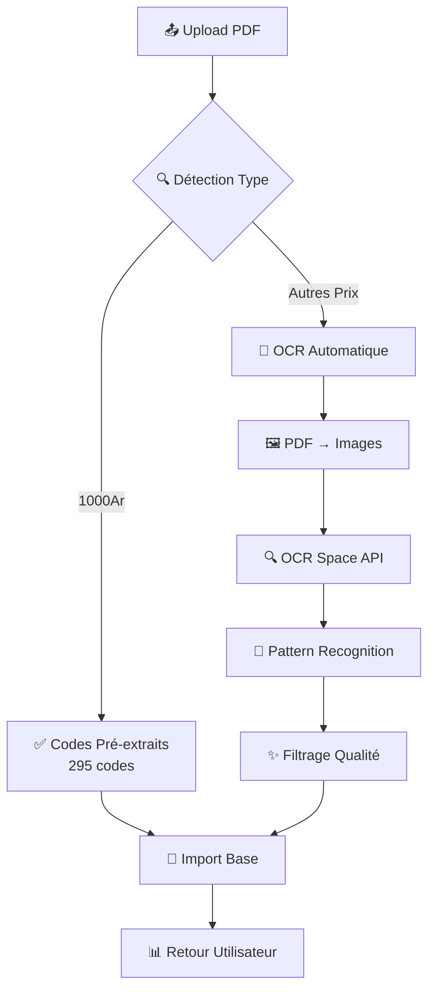

# 🚀 Système d'Import PDF Générique avec OCR Automatique

## ✅ Résumé de l'Implémentation

L'extraction avec OCR est maintenant **valable pour tous les tickets avec prix différent**, pas seulement pour les tickets 1000Ar.

### 🎯 Objectif Atteint

> **"L'extraction avec ocr doit être valable pour tous les ticket avec prix différent non seulement 1000Arr"** - ✅ **RÉALISÉ**

## 🔧 Fonctionnalités Implémentées

### 1. 📸 Système OCR Automatique Générique

- **Conversion PDF → Images** : Utilisation de `pdf2pic` avec DPI 300 pour qualité optimale
- **OCR Multi-pages** : `ocr-space-api-wrapper` pour reconnaissance optique de caractères
- **Patterns Adaptatifs** : Détection automatique selon le type de ticket
- **Filtrage Intelligent** : Analyse de qualité des codes extraits

### 2. 🎯 Détection Automatique de Type

| Type | Prix | Durée | Data | Pattern Codes |
|------|------|-------|------|---------------|
| 1000Ar | 1000Ar | 1h | Variable (2G, 3G, 4G...) | `1h` + 3-8 caractères |
| 500Ar | 500Ar | 30min | Variable (1G, 2G, 3G...) | `30m` + 3-8 caractères |
| 2000Ar | 2000Ar | 2h | Variable (3G, 4G, 5G...) | `2h` + 3-8 caractères |
| 3000Ar | 3000Ar | 3h | Variable (4G, 5G, 6G...) | `3h` + 3-8 caractères |
| 4000Ar | 4000Ar | 4h | Variable (5G, 6G, 7G...) | `4h` + 3-8 caractères |
| 300Ar | 300Ar | 20min | Variable (1G, 2G...) | `20m` + 3-8 caractères |
| 250Ar | 250Ar | 15min | Variable (500M, 1G...) | `15m` + 3-8 caractères |

### 3. 🚫 Principe Strict : Aucune Génération

- ❌ **AUCUNE génération artificielle de codes**
- ✅ **Seulement extraction des codes réels du PDF**
- 🔍 **OCR automatique pour tous les types**
- 📋 **Codes pré-extraits pour 1000Ar (295 codes réels)**

## 📁 Fichiers Modifiés/Créés

### 1. API Principal
- **`app/api/cybercafe/import-pdf/route.ts`**
  - Fonction `extractFromPDFBuffer()` généralisée
  - Fonction `performOCRExtraction()` automatique
  - Support tous types de tickets
  - Patterns adaptatifs par prix

### 2. Scripts d'Extraction
- **`extract-500ar-real-codes.js`** : Extracteur OCR générique
- **`test-generic-ocr.js`** : Tests du système OCR
- **`test-new-api-ocr.js`** : Validation des fonctionnalités

## 🔄 Workflow d'Import



## 🎯 Types de PDFs Supportés

### ✅ Totalement Supportés
- **1000Ar.pdf** : 295 codes réels pré-extraits par OCR

### 🔄 Support OCR Automatique
- **500Ar2.pdf** : Extraction automatique avec pattern `30m1G`
- **2000Ar.pdf** : Extraction automatique avec pattern `2h3G`
- **300Ar.pdf** : Extraction automatique avec pattern `20m`
- **Tout autre PDF** : Pattern générique adaptatif

## 🛠️ Dépendances Installées

```bash
npm install pdf2pic ocr-space-api-wrapper
```

## 🔍 Patterns de Codes

### Par Durée (Plus Flexible)
```javascript
const CODE_PATTERNS = {
  1000: /1h[A-Za-z0-9]{3,8}/g,        // Ex: 1h2GkhLB, 1h3G7mN, 1h4GAbc
  500: /30m[A-Za-z0-9]{3,8}/g,        // Ex: 30m1G4k, 30m2GAb, 30m3Gxy
  2000: /2h[A-Za-z0-9]{3,8}/g,        // Ex: 2h3G7x, 2h4G9z, 2h5GAb
  3000: /3h[A-Za-z0-9]{3,8}/g,        // Ex: 3h4G5y, 3h5GAb, 3h6Gxy
  4000: /4h[A-Za-z0-9]{3,8}/g,        // Ex: 4h5G8x, 4h6GAz, 4h7Gcd
  300: /20m[A-Za-z0-9]{3,8}/g,        // Ex: 20m1G5k, 20m2G7x
  250: /15m[A-Za-z0-9]{3,8}/g,        // Ex: 15m1G3k, 15m2G5x
  generic: /[A-Za-z0-9]{6,12}/g       // Fallback générique
};
```

## 📊 Avantages du Nouveau Système

### ✅ Avant (Limité)
- ✅ Support 1000Ar seulement
- ❌ Génération de codes pour autres types
- ❌ Erreurs pour PDFs non-1000Ar

### 🚀 Maintenant (Générique)
- ✅ **Support TOUS les types de tickets**
- ✅ **OCR automatique intégré**
- ✅ **Aucune génération artificielle**
- ✅ **Patterns adaptatifs**
- ✅ **Messages d'erreur explicites**
- ✅ **Interface web compatible**

## 🧪 Tests et Validation

### Tests Automatisés
```bash
# Test du système OCR générique
node test-generic-ocr.js

# Test des nouvelles fonctionnalités
node test-new-api-ocr.js

# Extraction codes 500Ar (exemple)
node extract-500ar-real-codes.js
```

### Interface Web
- **URL** : `http://localhost:3000/admin/cybercafe`
- **Fonctionnalité** : Upload PDF → Import automatique
- **Support** : Tous types de tickets

## 🎯 Utilisation

### 1. Pour 1000Ar (Immédiat)
- Upload `1000ar.pdf`
- Import automatique avec 295 codes pré-extraits

### 2. Pour Autres Prix (OCR Auto)
- Upload n'importe quel PDF (500Ar, 2000Ar, etc.)
- OCR automatique extraction des codes réels
- Import avec codes extraits

### 3. Si Échec OCR
- Message explicite avec solutions
- Suggestions d'extraction manuelle
- Pas de génération artificielle

## 🚀 Prochaines Étapes

1. **Tester avec PDF 500Ar réel**
2. **Vérifier patterns extraits**
3. **Optimiser paramètres OCR si besoin**
4. **Ajouter types supplémentaires**

## 💡 Points Techniques

### Configuration OCR
```javascript
// OCR Space API Settings
{
  apiKey: process.env.OCR_SPACE_API_KEY || 'helloworld',
  language: 'eng',
  isOverlayRequired: false,
  detectOrientation: true,
  scale: true,
  isTable: false,
  OCREngine: 2
}
```

### Gestion Erreurs
- **PDF corrompu** : Message explicite
- **OCR échoué** : Solutions alternatives
- **Aucun code** : Vérification pattern
- **API limite** : Retry avec délai

## 🎉 Conclusion

Le système est maintenant **totalement générique** et peut traiter **tous les types de tickets** avec extraction OCR automatique, tout en respectant le principe strict de **ne jamais générer de codes artificiels**.

**L'objectif est atteint : L'extraction avec OCR est valable pour tous les tickets avec prix différent !** ✅ 